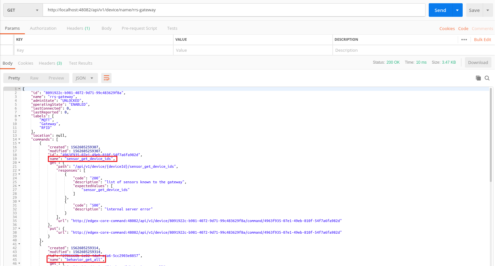
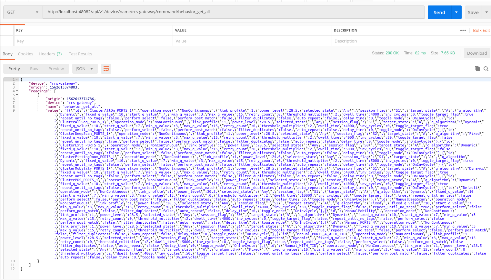

# Gateway Device Service
Based on the Edgex Go MQTT Device Service service, modified to support multiple
topics and extract device IDs from Gateway messages. Right now, it's more PoC 
then proper product.

## Requisite
* core-data
* core-metadata
* core-command

## Predefined configuration

### Incoming data listener and command response listener
Modify [`configuration-driver.toml`](cmd/res/configuration-driver.toml) file to
set your broker's Username & Password (the `saf-gateway-credentials` from the
IMA's `secrets` directory -- later, we can read these from a file). Also set the
address of your `mosquitto-server` if it's not in the same Docker network 
(alternatively, you can start the container with an `add-host` directive).

```toml
[Incoming]
Protocol = "tls"
# assumes that the server is reachable at this host. In docker, you can start
# a container with `--add-host "mosquitto-server:${your docker host IP}`
Host = "mosquitto-server"
Port = 9883 
# set the username/password to match the `saf-gateway-credentials`
Username = "saf"
Password = "{enter password here}"
Qos = 1
KeepAlive = 3600
MqttClientId = "IncomingDataSubscriber"
# modified to handle multiple topics -- subscribes to all of them
Topics = ["rfid/gw/events", "rfid/gw/alerts", "rfid/gw/heartbeat"]

[Response]
Protocol = "tls"
# same here -- needs to be set so it can connect
Host = "mosquitto-server"
Port = 9883 
Username = "saf"
Password = "{enter password here}"
Qos = 0
KeepAlive = 3600
MqttClientId = "CommandResponseSubscriber"
# since they use the same config, also takes multiple values/subscribes to all;
# currently, this isn't used anyway, since commands are the next logical step
Topic = ["ResponseTopic"]
```

### Device list
The end of the [configuration.toml](cmd/res/dev/configuration.toml) file should
have the name and address of your Gateway. This works successfully with the EdgeX
stack running somewhere other than the IMA stack, but if you're running them
on the same machine, you _should_ be able to set the `Address` to the Gateway's
service name. Note that this isn't bothering to define several aspects of the
`Addressable` -- such as `protocol` or `username`/`password`. Perhaps it really
is needed, but as it stands, it didn't seem necessary. 

```toml
[[DeviceList]]
  # Name needs to match the gateway's device ID
  Name = "rrs-gateway"
  Profile = "Gateway.Device.MQTT.Profile"
  Description = "Gateway Device MQTT Broker Connection"
  Labels = [ "MQTT", "Gateway", "RFID"]
  [DeviceList.Addressable]
    Name = "Gateway address"
    Protocol = "TCP"
    # this address probably doesn't matter
    Address = "192.168.99.100"
```

## Building/Running 
The [Makefile](Makefile) and [Dockerfile](Dockerfile) are both edited to better
match our typical setup, rather than the EdgeX format. 

To run, update the `SRC_PATH` in the Makefile, if needed, then:
```bash
make image # build the image
make run   # run the docker-compose.yml
make down  # stop the compose
make dev   # run a container using the dev configuration; may require some changes
make clean # remove control files
```

`make build` creates a `golang:1.12` container named `gobuilder`, mounts the
`$(GOPATH)/src/$(SRC_PATH)`, and then builds the `mqtt-device-service`. It
also creates a named volume for Go's build cache in order to speed up later builds.

> Note the `SRC_PATH` variable, which is assuming the file structure! Update it
> as necessary so the builder will successfully mount your code.

`make run` brings up the [`docker-compose.yml`](docker-compose.yml), which points
to all the `delhi` EdgeX images, a `Portainer` instance (on :9000), and the current
service image (built, if necessary).

`make dev` starts a container on the EdgeX network, doing a few things:
1. Sets `--profile=dev --confdir=/res` with the `/cmd/res` directory mounted.
This makes use of the [dev/configuration.toml](cmd/res/dev/configuration.toml).
Modify the path (or file) as necessary.
1. Sets `no_proxy="*"` and `NO_PROXY="*"` (it's sometimes important to say it louder).
1. `--add-host` to modify `mosquitto-server`'s address. You'll almost certainly 
need to modify this address, or just remove it, if `mosquitto-server` is running 
on the same Docker host & network as your EdgeX instance.

`make clean` will remove the "control" file to prevents rebuild.

## Sending Commands to gateway
To send commands from Edgex to Intel open source gateway we can use some client such as POSTMAN [https://www.getpostman.com/].
 
Open POSTMAN or any similar tool and execute the following apis:

- Replace `localhost` in the below api with your respective server IP address if not running on localhost. This api is
used to find all the executable commands for a particular device (rrs-gateway is the default name of the Intel open
source gateway)
```
GET to http://localhost:48082/api/v1/device/name/rrs-gateway
```
- If the GET request is successful a json response is received from which all the executable commands can be found



- The commands can be be sent by modifying the above api. For e.g. the below api is used to send a command known as
`behavior_get_all` 
```
GET to http://localhost:48082/api/v1/device/name/rrs-gateway/command/behavior_get_all
```

- If the above request is successful a json response is received from which the gateway response can be found in the
`value` field.



  
